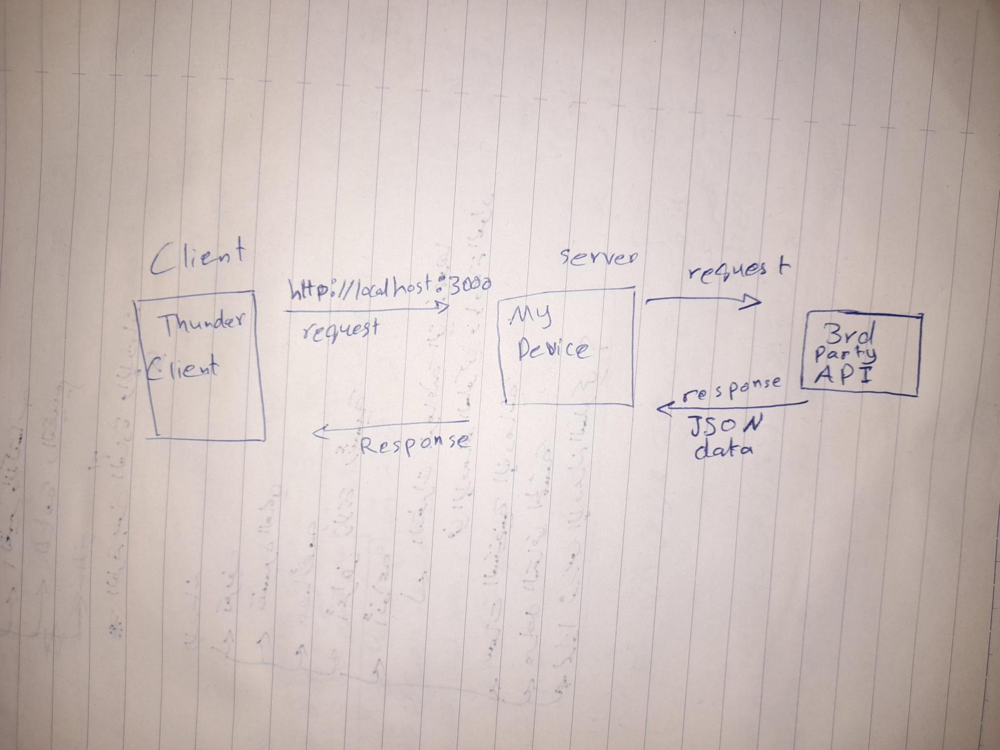

# Movies-Library - 0.0.2

**Author Name**: Zaid Rajab

## WRRC



## Overview

## Getting Started

*   firstly run this command in the project to get package.json file:
```
npm init -y
```
*  install Thunder Client extension
*  open the project in terminal and run this command : node server.js
*  in Thunder client request use get method on this address: http://localhost:3000


## Project Features
*  Handling errors
*  Get data from 3rd party API
*  Insert data to a database
*  Get data from a database